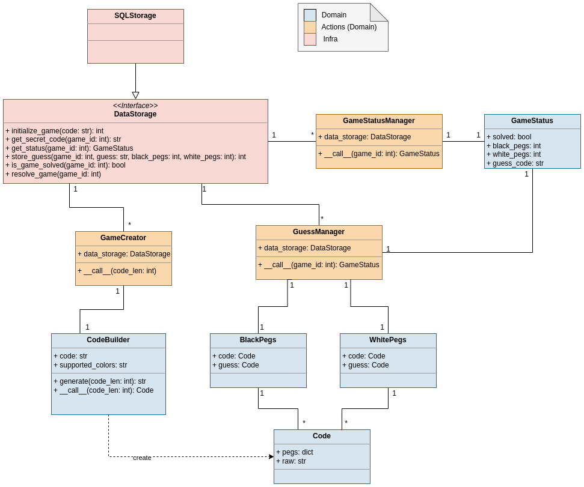

# Mastermind

The project consists of a REST API to play the game Mastermind.

---

## Execution instructions

- To run the service and the database use the following command. It will build the Dockerfile and download and run a postgres database.
    ```
    make run
    ```

    > Mastermind service will be expose in [**localhost:5000**](localhost:5000)

- Once the service is running, in order to see the API go to [docs](localhost:5000/docs)

- To build only the Docker image, execute:
    ```
    make build
    ```

    > It will build a Docker image called **mastermind:$TAG**


- To run the tests, execute:
    ```
    make test
    ```

    > It will run the pytest tests in "tests" folder

---

## Questions

* What is your favorite package manager and why?
    > pip and requirements.txt. Honestly, I've only ever used this package manager, but had several problems due to unfixed dependencies of dependencies. Also, I explored Pipfile.


* What architecture did you follow for this project?
    > I have used hexagonal architecture (or ports and adapters). It isolates the external dependencies (data storage) of the adapters and gives you the advantage of developing the domain without considering the infrastructure.


* Do you know and understand UML? What would the class diagram of the domain exposed in the mastermind game be like for you?
    > 


* What tools are you aware of to handle things like code styling and consistency, formatting, typing…?
    > I usually use these type of tools with pre-commit hooks.
    > - [black](https://github.com/psf/black): Code formating
    > - [Flake8](https://flake8.pycqa.org/): Code linting
    > - [isort](https://github.com/PyCQA/isort): Import sorting


* Is there anything you would like to comment about the project, this small exercise, etc?
    > - First approach: I started trying to solve the problem with matrices, where the columns would be the secret code and the rows would be the guess. One column/row per color. Each cell would have 3 possible values: True, False or None. It would be True when the row and column had same position and color, False when only had the color or None otherwise. I was not be able to build this matrix.
    > - Second approach: I have represented each code in a dict, where each key is the color and each value is a list with the positions of this color in the code/guess. To find black pegs I had to search the intersection between both postion lists. To find white pegs I had to search the number of possible white pegs removing blakc ones and the count if there are candidates. There are candidates when I remove the black pegs and then there are free positions in secret code and free position in guess code.
